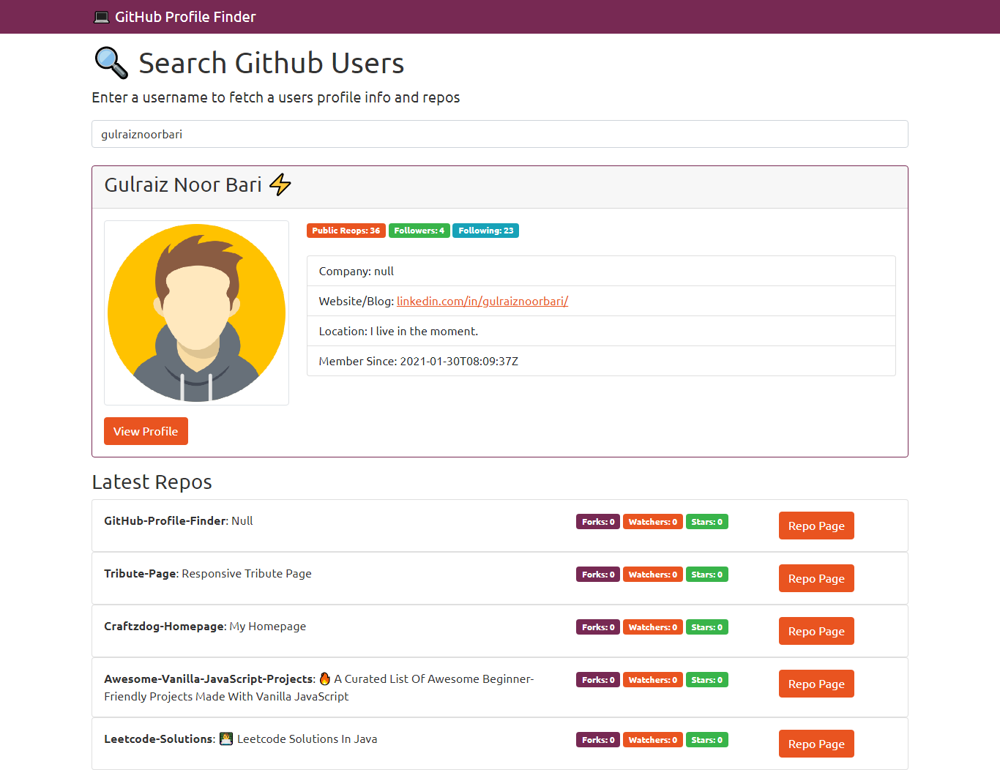

<h2>GitHub Profile Finder</h2>

<h4>Tech Stack Used:</h4>
<li> jQuery </li>
<li> Ajax </li>
<li> Bootstrap 4 </li>
<li> GitHub API </li>

## Author

You can get in touch with me on my LinkedIn Profile:

#### Gulraiz Noor Bari

 

You can also follow my GitHub Profile to stay updated about my latest projects: 

If you liked the repo then kindly support it by giving it a star ⭐!

## Contributions Welcome

If you find any bug in the code or have any improvements in mind then feel free to generate a pull request.
